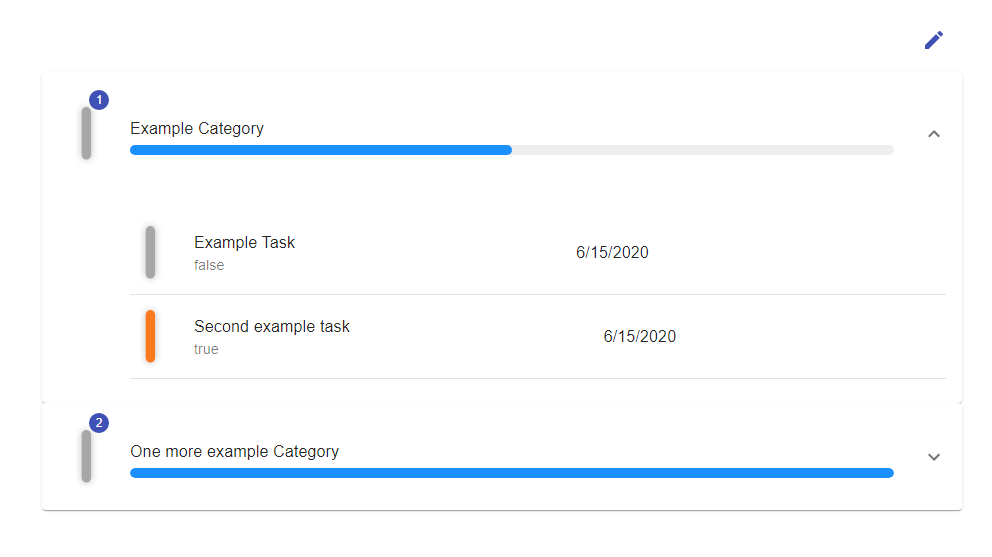

> ### React.js + Express.js with Apollo GraphQl API + Redis

# GetNoted

Organise, list and store all your tasks. Small React app with express.js backend made for WWWiJS. 
Based on GrapqhQl API implemented with Apollo. Basic JWT and Passport authentication. 

## Getting started
To get app running locally:

**With docker:**
- Clone repo
- Use `development` mode by changing it in `docker-compose.yml`, 
and make sure `/graphql` api address in `frontend-react` (`/frontend-react/src/constants/index.js` file) is valid (on Windows docker it is usually `192.168.99.100`)
- Run `docker-compose.yml`
- `cd frontend-react`
- `npm install`
- `npm start`

App should be available on `localhost:3000` with server served inside docker machine.

**Witnout docker:**

- Clone repo
- Install `Redis`
- export address of running redis daemon as envirement variable `REDIS_URL`
- `cd frontend-react`
- `npm install`
- `npm start`
- `cd ../server-node`
- `npm install`
- `npm start`

## General overview 
This repo contains 3 main parts:
- `frontend-react`: React.js app
- `main-server-mock`: Mock server used in early development 
(should not work well with current frontend part)
- `server-node`: Node server based on Express.js

### Frontend
Inside `src` catalog are:
- `/components`: contains all React components used in app and a little more
- `/constatnts`: used for defining global variables
- `/localization`: used for to handle multiple website languages (currently Polish and English)
- `/styles`: SCSS catalog containing custom styles

and `index.js` where `Apollo Graphql client` is created and `App.js` as entry point for Application.
It uses `react-router` as form of website routing with additional `JWT` authentication carried by Node server.

### Backend
Backend (`server-node`) is divided into several parts:
- `/gql`: contains `scheme.graphql` and `resolvers.js` used as resolvers
- `/redis-client`: as name suggests it defines basic client for communication with Redis daemon
- `app.js`, `/bin/www`: defines Express.js server and Apollo Server

## Features

List below contains several features included in project:

- Ability to add new "categories" and within "tasks" with dynamic content refresh (achieved with Apollo subscriptions)
- Drag and Drop elements in Categories list
- Change status of each task, with dynamic progress bar change
- routing done with `react-router` guarded by `JWT` generated by server

Categories and tasks preview screenshot:

